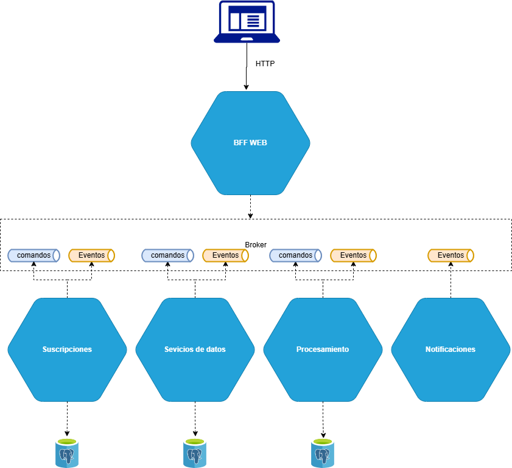
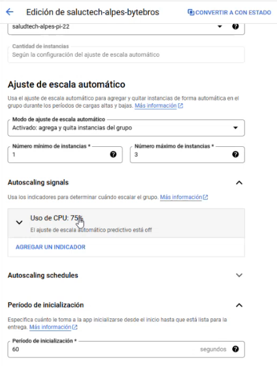
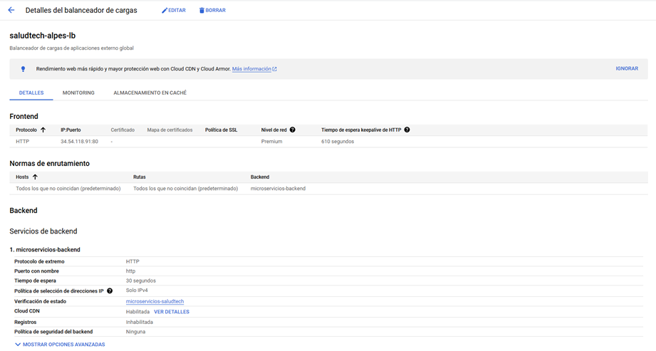
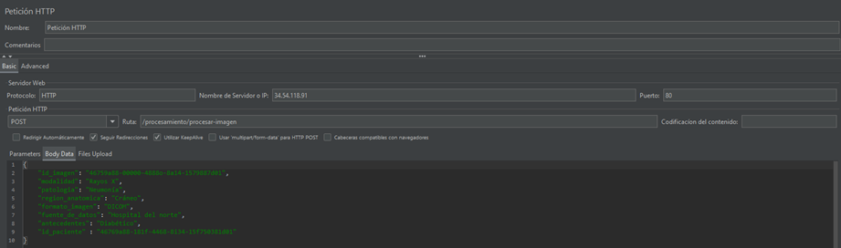
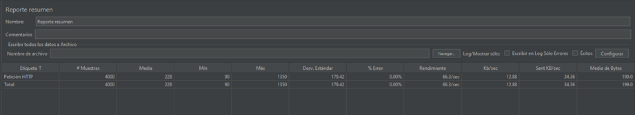
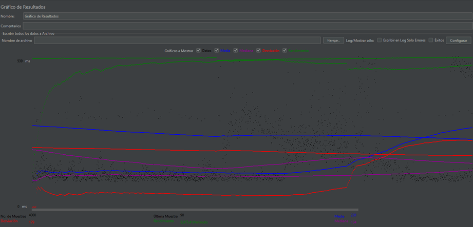
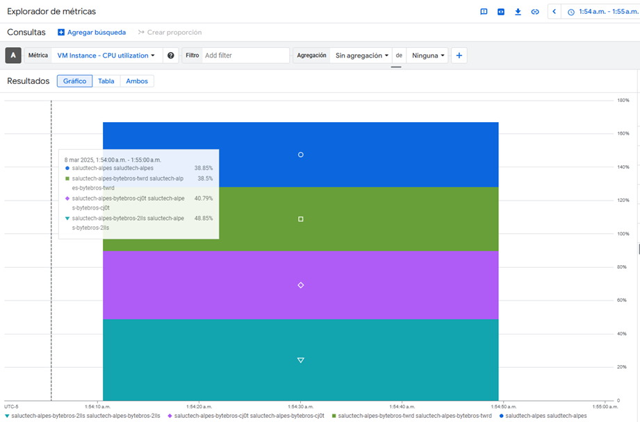
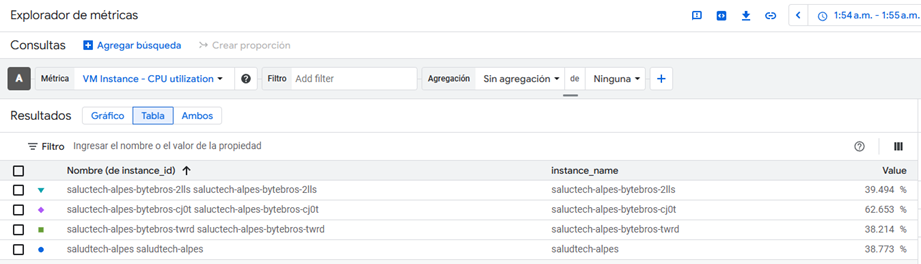

# Sistema saludtechalpes

## Miembros:

- Monica Muñoz
- Luz Ochoa
- Andres Lombo
- Humberto Maury

## Diagrama de la solución



## Escenarios de calidad 

[Descargar Archivo](escenarios_calidad.pdf)

## Escenarios de calidad a implementar
1. Escenario de calidad 3: Escalabilidad con Concurrencia(Load Balancer)
Evalúala capacidaddel sistemapara manejaraltos volúmenesde solicitudes concurrentes, distribuyéndolasde maneraeficienteentre las instanciasdel sistemamedianteun patrónde Load Balancer. El sistemadebeser capazde procesarpaquetesde imágenes, distribuyendola carga entre diversasinstanciasde procesamiento, manteniendola baja latencia, altadisponibilidady toleranciaa fallos, especialmenteal manejareventosde procesamientogeneradosporelsistema.

2. Escenario de calidad 6: Integridad y seguridad de los datos
El sistema debe garantizar la integridad y seguridad de los datos en las transacciones entre los microservicios de suscripciones, servicio de datos y notificaciones, asegurando que no haya inconsistencias o fallos en el flujo de información.

3. Escenario de calidad 8: Modificacionesy extensibilidadenelprocesode suscripción
El sistemadebepermitirmodificacionesy extensibilidadenelprocesode suscripción, asegurandobajo acoplamientoy facilitandola integraciónde nuevosproductosy cambiossin afectarla arquitecturaexistente.

## Decisiones de diseño

- Los microservicios con bases de datos son: suscripciones, procesamiento y servicio de datos.

- Administración de datos descentralizada: La administración de bases de datos descentralizada se implementará debido a su capacidad para mejorar la escalabilidad, el rendimiento y la resiliencia del sistema. Al permitir que cada microservicio gestione su propia base de datos, se evita el acoplamiento, lo que facilita el desarrollo independiente y reduce los cuellos de botella. Además, se mejora la seguridad, ya que cada equipo puede gestionar accesos y permisos de forma autónoma. Aunque esto implica una mayor complejidad en la gestión de datos y transacciones, la base de datos descentralizada se alinea con las decisiones tomadas sobre el uso de comandos y eventos.

- Patrón de almacenamiento: los microservicios con base de datos se usará el módelo CRUD y para el microservicio de notificacicones Event sourcing.

- Patrón Saga: en el proceso de suscripciones de planes PRO debido a que se requiere una transacción distribuida para garantizar la correcta creación de todos los recursos necesarios para dicho tipo de servicios, donde tendremos una transacción larga a través de los microservicios de suscripción, servicio de datos y notificación. Además se apoyará la persistencia de estados en Apache Pulsar.

- Los servicios necesarios para la implementación del proyecto serán desplegados en GCP, basados en los conocimientos del equipo de implementación.

- La arquitectura de microservicios con bases de datos descentralizada favorece la escalabilidad, principalmente el microservicio de procesamiento de datos necesitará poder escalar horizontalmente, tal tal forma se busca atender multiples procesos de aninimizado en paralelo despues de la carga de muchas imagenes por parte de los centros de salud. 

## Microservicios

1. Suscripciones
2. Procesamiento
3. Servicio de datos
4. Notificaciones

## Microservicio suscripciones

**Responsable**: Humberto Maury

**Documentación**: [README](./microservicio-suscripciones/README.md)

**Actividades**: 

    [x] Definir la entidad raiz, entidades y objetos valor.

    [x] Implementar repositorios de acceso a datos usando postgresDB.

    [x] Implementar mappers para dtos de infraestructura.

    [x] Definir los camandos y eventos en la capa de aplicacion. 

    [x] Definir los queries en la capa de aplicacion.

    [x] Suscribirse a los topicos de eventos y comandos. 

    [x] Publicar eventos de integracion. 

    [x] Implementar mappers para dtos de aplicacion.

    [x] Configurar Dockerfile y actualizar el docker-compose.

### Comandos: 

**ComandoCrearSuscripcion**:
        
    schema-type: Cloud event + AVRO

    version: v1

    Payload:

```py
        class ComandoCrearSuscripcionPayload(ComandoIntegracion):
            cliente_codigo = String()
            cliente_nombres = String()
            cliente_apellidos = String()
            cliente_usuario = String()
            cliente_rut = String()
            cliente_cedula = String()
            cliente_email = String()
            plan_codigo = String()
            plan_nombre = String()
```    
**ComandoCambiarPlanSuscripcion:**
        
    Schema-type: Cloud event + AVRO

    Version: v1

    Payload: TBD

**ComandoCancelarSuscripcion:**
    
    Schema-type: Cloud event + AVRO

    Version: v1

    Payload: TBD

**ComandoPagarSuscripcion:**
    
    Schema-type: Cloud event + AVRO

    Version: v1

    Payload: TBD
        
### Eventos: 

**EventoSuscripcionCreada**

    type: Integracion - Fact

**EventoSuscripcionCancelada**

    type: Integracion - Fact

**EventoSuscripcionPlanModificado**

    type: Integracion - Fact

**EventoSuscripcionPagada**

    type: Integracion - Fact

## Microservicio procesamiento

**Responsable**: Andrés Lombo

**Documentación**: [README](./microservicio-suscripciones/README.md)

**Actividades**: 

    [x] Definir la entidad raiz, entidades y objetos valor.

    [x] Implementar repositorios de acceso a datos usando postgresDB.

    [x] Definir los comandos en la capa de aplicacion. 

    [x] Definir los queries en la capa de aplicacion.

    [x] Definir los eventos en la capa de dominio.

    [x] Definir consumidores que se suscriben a los topicos de eventos y comandos. 

    [x] Definir despachadores para publicar eventos de dominio. 

    [x] Configurar Dockerfile y actualizar el docker-compose.

### Comandos: 

**ComandoCrearSuscripcion:**
    
    schema-type: AVRO

    Payload:
```py
        class ImagenAnonimizada(Entidad):
            self.id_imagen = id_imagen
            self.modalidad = modalidad
            self.patologia = patologia
            self.region_anatomica = region_anatomica
            self.formato_imagen = formato_imagen
            self.fuente_de_datos = fuente_de_datos
            self.antecedentes = antecedentes
            self.id_paciente = id_paciente
            self.fecha_ingesta = fecha_ingesta
```   

### Queries:

    ### ObtenerImagenAnonimizada

### Eventos:
**EventoAnonimizacion**

    type: Dominio

**EventoConsultaAnonimizacion**

    type: Integración

## Microservicio servicios de datos

**Responsable**: Monica Muñoz

**Documentación**: [README](./microservicio-servicio-datos/README.md)

**Actividades**: 

    [x] Definir la entidad raiz, entidades y objetos valor.

    [x] Implementar repositorios de acceso a datos usando postgresDB.

    [x] Implementar mappers para dtos de infraestructura.

    [x] Definir los camandos y eventos en la capa de aplicacion. 

    [x] Definir los queries en la capa de aplicacion.

    [x] Suscribirse a los topicos de eventos y comandos. 

    [x] Publicar eventos de integracion. 

    [x] Implementar mappers para dtos de aplicacion.

    [x] Configurar Dockerfile y actualizar el docker-compose.

### Comandos: 

**ComandoCrearServicioDatos:**
    
    schema-type: Cloud event + AVRO

    version: v1

    Payload:
```py
        class ComandoCrearServicioDatosPayload(ComandoIntegracion):
            cliente_codigo = String()
            cliente_nombres = String()
            cliente_apellidos = String()
            cliente_usuario = String()
            plan_codigo = String()
            plan_nombre = String()
            experto_codigo = String()
            experto_nombres = String()
            experto_apellidos = String()
            experto_usuario = String()
            experto_cedula = String()
            experto_email = String()
            nube.codigo = String()
            nube.nombre = String()
            nube.tipo = string()
            dataset.codigo = string()
            dataset.nombre = string()
            suscripcion.codigo = string()
            
```    
**ComandoIniciarServicioDatos**
    
    Schema-type: Cloud event + AVRO

    Version: v1

    Payload: TBD

**ComandoAsignarExperto:**
    
    Schema-type: Cloud event + AVRO

    Version: v1

    Payload: TBD

**ComandoTerminarServicioDatos:**
    
    Schema-type: Cloud event + AVRO

    Version: v1

    Payload: TBD
        
### Eventos: 

**EventoServicioDatosCreada**

    type: Integracion - Fact

**EventoExpertoAsignado**

    type: Integracion - Fact

**EventoServicioDatosIniciado**

    type: Integracion - Fact

**EventoServicioDatosTerminado**

    type: Integracion - Fact


## BFF WEB

**Responsable**: Humberto Maury

**Documentación**: [README](./bff_web/README.md)

**Actividades**: 

    [x] Crear endpoint comando crear suscripcion.

    [x] publicar comando en el topico.

    [ ] Implementar queries.
    
    [x] Configurar Dockerfile y actualizar el docker-compose.

### Endpoints: 

    **Endpoint**: `/suscripciones/suscripcion-comando`

    **Método**: `POST`

    **Headers**: `Content-Type='aplication/json'`

    ```json
    {
    "cliente": {
            "codigo": "0001",
            "nombre": {
                "nombres": "Pablo",
                "apellidos": "Perez Prieto"
            },
            "usuario": "pperez",
            "rut": {
                "numero": 123457890
            },
            "cedula": {
                "numero": 123457890
            },
            "email": "pperez@domain.com"
    },
    "plan": {
            "codigo": "pro",
            "nombre": "PRO"
    },
    "facturas": []
    }
    ```

## Microservicio de Notificaciones

**Responsable**: Luz Ochoa

Este microservicio está diseñado para gestionar y enviar notificaciones basadas en eventos dentro de un sistema distribuido. Utiliza Apache Pulsar como sistema de mensajería para recibir eventos y generar notificaciones correspondientes.

**Descripción**:

El microservicio de Notificaciones escucha eventos desde un sistema de mensajería basado en Apache Pulsar y procesa estos eventos para generar notificaciones a los usuarios, procesa los eventos utilizando un consumidor en segundo plano.

Este microservicio sigue un enfoque Event-driven, lo que significa que reacciona a los eventos generados en otros microservicios o sistemas, y no depende de consultas directas a bases de datos. En lugar de almacenar el estado de las notificaciones, se procesan eventos para cada acción, siguiendo el patrón de Event Sourcing.

**Actividades**: 

    [x] Suscribirse al topico de notificaciones.

    [ ] procesar mensajes.

    [x] Configurar Dockerfile y actualizar el docker-compose.


### Funcionalidades:

**Recepción de eventos:**
El microservicio se suscribe a un tópico de eventos de Apache Pulsar (por ejemplo, suscripciones-topic).
Escucha los mensajes que se publican en el tópico y procesa los eventos de suscripciones que llegan.

**Generación de notificaciones:**
Cuando un evento de suscripción es recibido, el microservicio genera una notificación asociada a dicho evento.
La notificación puede ser enviada a un sistema externo o almacenada internamente según los requisitos del sistema.

**Almacenamiento de eventos:**
Los eventos de suscripción recibidos se almacenan en un Event Store.
Este enfoque permite reconstruir el estado o realizar auditorías sin necesidad de una base de datos centralizada.

**Publicación de mensajes:**
El microservicio puede generar eventos de salida (notificaciones procesadas) y publicarlos en un sistema de mensajería como Pulsar para otros servicios.

**Consumo de mensajes en segundo plano:**
Los mensajes son procesados en un hilo separado para evitar que el servidor web de Flask se bloquee y para poder manejar múltiples eventos de manera concurrente.


### Eventos de microservicio

**Evento de Notificación Creada:**
Se emite cuando una notificación es generada en respuesta a un evento de suscripción.

**Evento de Notificación Enviada:**
Se emite cuando la notificación ha sido enviada con éxito al usuario.

**Evento de Error en el Procesamiento de Notificación:**
Se emite cuando ocurre un error al procesar o enviar una notificación.

**Evento de Confirmación de Notificación:**
Se emite como una confirmación de que la notificación fue procesada correctamente.


### Ejecución en docker-compose usando profiles

```bash
docker-compose --profile pulsar --profile suscripciones --profile procesamiento --profile bff_web up --profile notificaciones --profile serviciodatos up -d --build
```

### Despliegue en GCP: 

**URL BFF WEB:**
http://34.136.120.7:5005

### DOCUMENTO DE RESULTADOS DE EXPERIMENTOS

Aquí va el documento con los resultados.

### EXPERIMENTO #1: Escalabilidad con Concurrencia (Load Balancer)

**Construcción del experimento:**
Se creó el grupo de contenedores en GCP, un grupo de mínimo 1, máximo 3, como regla que al alcanzar el 75% de capacidad de CPU, se redirigiera a otra instancia.
Para éste grupo de instancias, se usaba una plantilla de instancia con las instrucciones para correr el proyecto.



Luego se construyó el balanceador de carga:


Se configura el JMeter:
Propiedades del Hilo:

Número de Hilos: 1000
→ Simula 1000 usuarios virtuales concurrentes en la prueba.
Periodo de Subida (Ramp-Up Period) en segundos: 60
→ Los 1000 hilos se iniciarán en 60 segundos, es decir, JMeter agregará aproximadamente 16-17 usuarios por segundo hasta alcanzar los 1000.
Contador del Bucle: 4
→ Cada hilo ejecutará 4 iteraciones antes de finalizar. Si estuviera en "Sin fin", se ejecutaría de manera indefinida.

Posible impacto:
Esta configuración genera una carga muy alta en un tiempo relativamente corto (60s). Si el sistema no está bien preparado, podría colapsar debido al número de solicitudes simultáneas.


Después se configura el JMeter con la dirección del balanceador de carga:
**http://34.54.118.91:80**
Utilizando el endpoint del BFF: '/procesar/procesar-imagen', methods=['POST']
Header:
Content-Type = json/application
Body:
```json
{
    "id_imagen": "46769a88-00000-4468o-8a14-1579887d01",
    "modalidad": "Rayos X",
    "patologia": "Neumonía",
    "region_anatomica": "Cráneo",
    "formato_imagen": "DICOM",
    "fuente_de_datos": "Hospital del norte",
    "antecedentes": "Diabético",
    "id_paciente" : "46769a88-181f-4468-8i34-15f750381d01",
    "fecha_ingesta": "2024-02-01 09:10:00"
}
```


### Resultados Experimento 1.





1.El sistema es capaz de distribuir las solicitudes entre las instancias disponibles, sin que ninguna supere el 75% de su capacidad.
 
2.La hipótesis se cumplió gracias a la aplicación del patrón del load balancer, la escalabilidad dinámica, la arquitectura utlizando mensajería asincrónica por medio de apache pulsar entre el bff y el ms de procesamiento, además da la táctica de Monitor la cuál le permitieron al sistema identificar con rapidez las instancias que presentaban errores y retirarlas de la operación del sistema. Debido al desacoplamiento del microservicio de procesamiento pudo escalar de manera independiente, escuchando los eventos del bff para que cuando se disparara un comando, ejecutara el evento.

Se obtuvieron los siguientes resultados:

Buen rendimiento: Tiempo de respuesta promedio de 228 ms, lo cual es rápido (menos de 2 segundos).

Baja latencia mínima (90 ms), lo que indica que el servidor puede manejar respuestas rápidas en algunos casos.

Sin errores (0.00%), lo que significa que todas las solicitudes fueron exitosas.

Tiempo máximo de 1,350 ms: Aunque el promedio es bajo, algunas solicitudes tardaron más de 1 segundo. Puede ser una señal de sobrecarga en momentos puntuales.

Desviación estándar de 179.42 ms, lo que indica cierta variabilidad en los tiempos de respuesta.

Ninguna instancia supera el 75% de uso, lo máximo que alcanza una instancia es el 49% de uso de CPU.

Para consultar detalles de los resultados consulte el DOCUMENTO DE RESULTADOS DE EXPERIMENTOS.

### Colección de postman para pruebas:

[Postman file](byteBros-saludTechAlpes.postman_collection.json)
