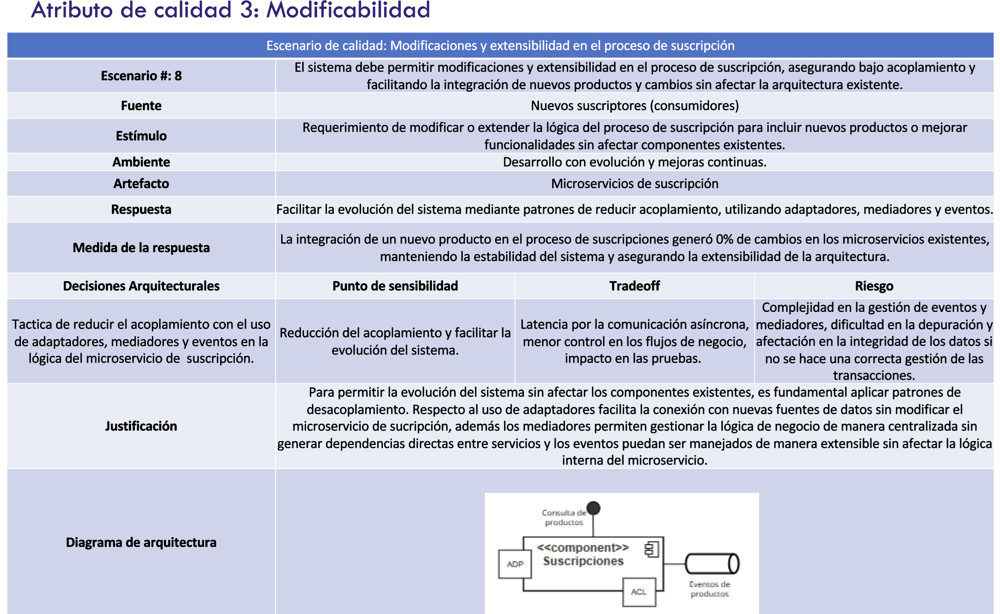

# byteBros-saludtechalpes: Microservicio Servicio de datos

## Miembros:

- Monica Muñoz
- Luz Ochoa
- Andres Lombo
- Humberto Maury


## Instalar dependecias
```bash
pyenv install 3.10.7 -f && pyenv local 3.10.7
```

```bash
pip install -r requirements.txt
```

## Ejecutar Aplicación

Desde el directorio principal ejecute el siguiente comando.

```bash
flask --app src/servidiodatos./api run
```

Siempre puede ejecutarlo en modo DEBUG:

```bash
flask --app src/servidiodatos./api --debug run
```


### docker build 
```bash
docker build . -f servidiodatos.Dockerfile -t servidiodatos/flask
```

### Correr docker-compose usando profiles
```bash
docker-compose --profile pulsar --profile servidiodatos up
```

### Escenario de calidad 



### Escenarios de calidad 

[Descargar Archivo](escenarios_calidad.pdf)
```
