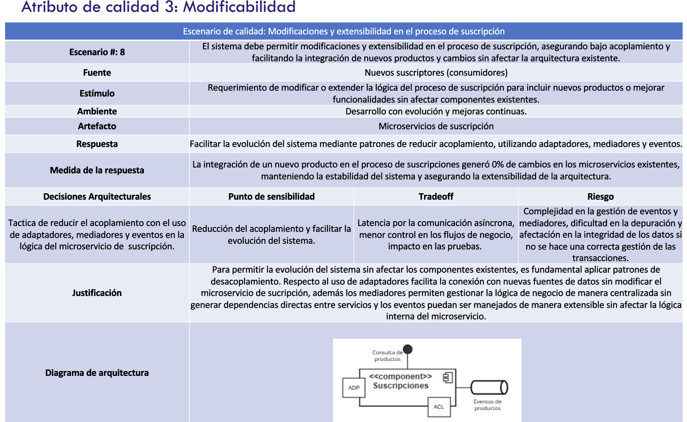

# byteBros-saludtechalpes: Microservicio Suscripciones

## Miembros:

- Monica Muñoz
- Luz Ochoa
- Andres Lombo
- Humberto Maury


## Instalar dependecias
```bash
pyenv install 3.10.7 -f && pyenv local 3.10.7
```

```bash
pip install -r requirements.txt
```

## Ejecutar Aplicación

Desde el directorio principal ejecute el siguiente comando.

```bash
flask --app src/saludtechalpes./api run
```

Siempre puede ejecutarlo en modo DEBUG:

```bash
flask --app src/saludtechalpes./api --debug run
```


## Request de ejemplo

Los siguientes JSON pueden ser usados para probar el API:

### Crear suscripción

- **Endpoint**: `/suscripciones/suscripcion-comando`
- **Método**: `POST`
- **Headers**: `Content-Type='aplication/json'`

```json
{
   "cliente": {
        "codigo": "0001",
        "nombre": {
            "nombres": "Pablo",
            "apellidos": "Perez Prieto"
        },
        "usuario": "pperez",
        "rut": {
            "numero": 11111111
        },
        "cedula": {
            "numero": 22222222
        },
        "email": "pperez@domain.com"
   },
   "plan": {
        "codigo": "pro",
        "nombre": "PRO"
   },
   "facturas": []
}
```

### docker build 
```bash
docker build . -f saludtechalpes.Dockerfile -t saludtechalpes/flask
```

### Correr docker-compose usando profiles
```bash
docker-compose --profile pulsar --profile saludtechalpes up
```

### Escenario de calidad 



### Escenarios de calidad 

[Descargar Archivo](escenarios_calidad.pdf)